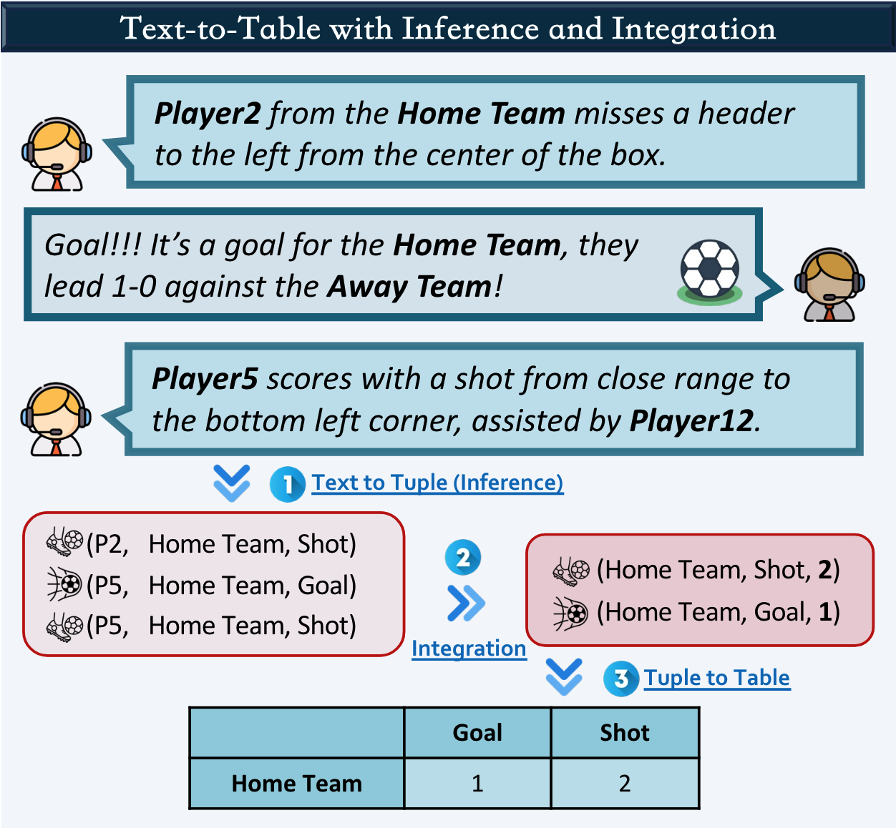

# Text-Tuple-Table: Towards Information Integration in Text-to-Table Generation via Global Tuple Extraction


This is the official code and data repository for the paper:
[Text-Tuple-Table: Towards Information Integration in Text-to-Table Generation via Global Tuple Extraction](https://arxiv.org/abs/2404.14215).




## LiveSum Dataset

The LiveSum dataset can be found in the ``data/`` folder.

## Evaluation

To evaluate the results, you can use the following command:
```shell
python evaluate.py --data data --output examples
```
